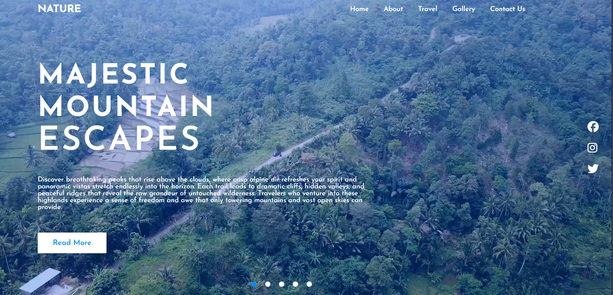

# 🌿 Nature & Travel Website

A responsive ature & Travel landing page built using HTML, CSS, and JavaScript.  

This project is designed as a student practice project (SMK TKJ) to demonstrate front-end skills such as layout design, responsive navigation, video backgrounds, and interactive sliders.

---

## 📸 Screenshot

---

## 🚀 Features

- Fullscreen video background slider

- Animated navigation menu (mobile responsive)

- Smooth transitions between slides

- Modern typography and layout

- Interactive slider navigation buttons

- Social media icons

- Responsive design for smaller screens

---

## 🛠️ Built With

- HTML5

- CSS3

- JavaScript (Vanilla)

- Font Awesome Icons

- Google Fonts "Josefin sans"

---

## 📂 Project Structure

project-folder/

│

├── index.html

├── README.md

├── LICENSE

│

├── assets/

│ ├── css/

│ │ └── style.css

│ ├── js/

│ │ └── main.js

│ └── img/

│ ├── 1.mp4

│ ├── 2.mp4

│ ├── 3.mp4

│ ├── 4.mp4

│ ├── 5.mp4

│ ├── menu.png

│ ├── close.png

│ └── screenshot.png

---

## 🎓 Educational Purpose

This project was created as a \*\*learning exercise for TKJ students\*\* to practice:

- Website structure

- Styling techniques

- UI layout design

- DOM manipulation

- Responsive development

---

## ▶️ How to Run

1. Download or clone this repository

2. Open folder

3. Run `index.html` in your browser

---

## 📄 License

This project is licensed under the MIT License — see the LICENSE file for details.

---

## ✨ Author Notes

Feel free to modify, improve, and experiment with this project for learning purposes.

